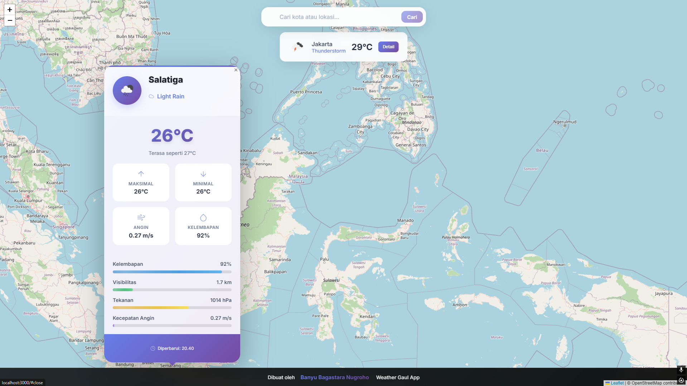
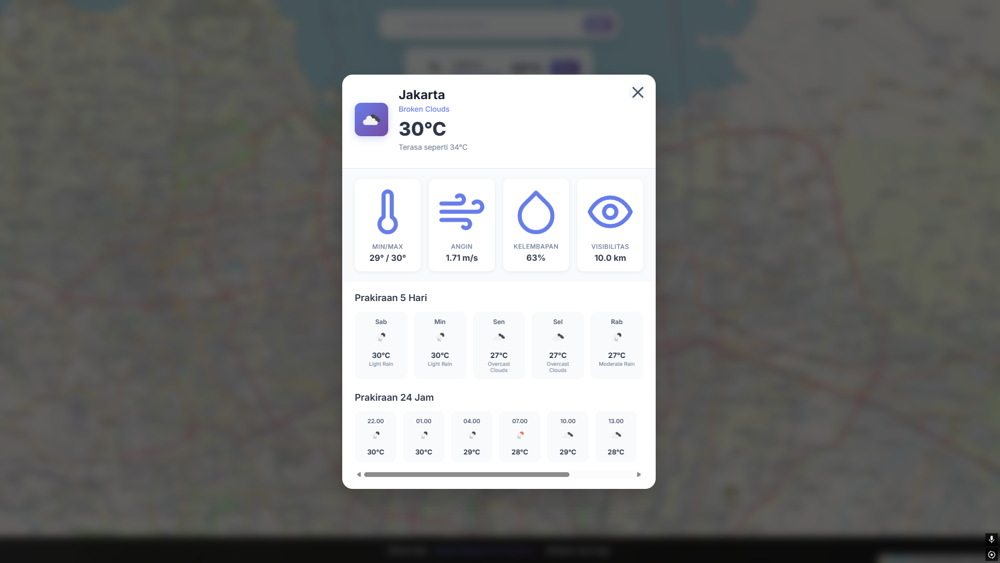
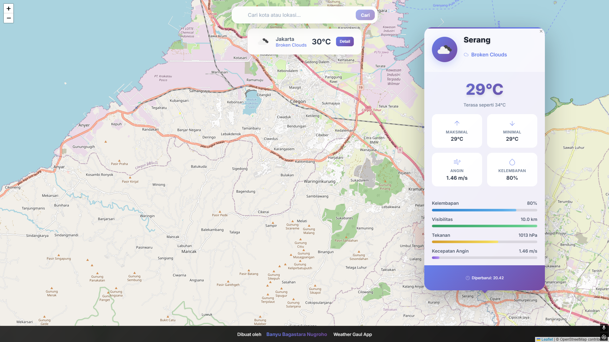

# 🌦️ Weather Gaul App

*Weather forecasts with a fresh, modern twist*

A contemporary weather application that delivers accurate forecasts with a clean, user-friendly interface and delightful micro-interactions.

## Screenshots

## ✨ Key Features

- **Intuitive Interface**  
  Clean design with essential weather metrics
- **5-Day Forecast**  
  Detailed hourly and daily predictions
- **Interactive Map**  
  Visualize weather patterns geographically
- **Dark/Light Mode**  
  Comfortable viewing in any lighting
- **Smart Notifications**  
  Weather alerts with helpful suggestions

## 🛠️ Tech Stack

- **Frontend**: React + TypeScript
- **Build Tool**: Vite
- **Styling**: Tailwind CSS
- **Maps**: Leaflet.js
- **API**: OpenWeatherMap
- **Animation**: Framer Motion

## Feedback

If you have any feedback, please reach out to us at anyugantenk@gmail.com

